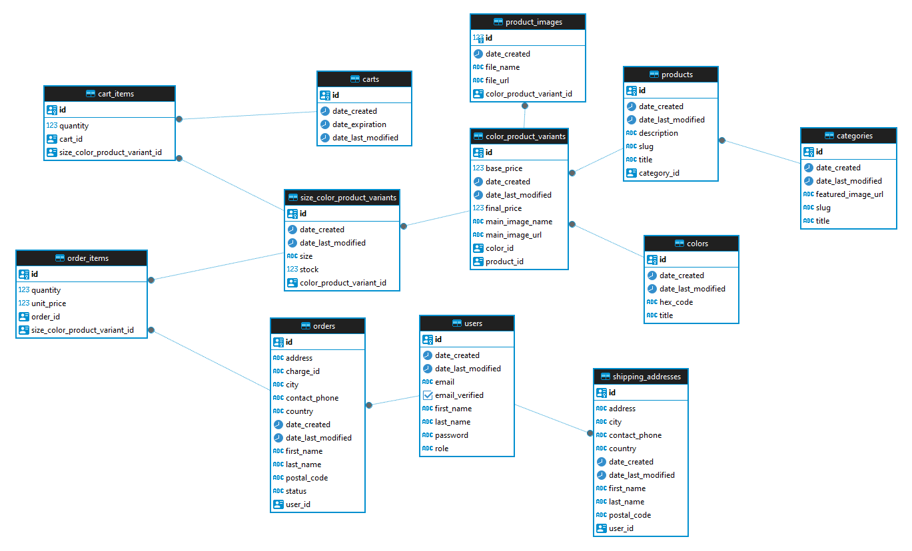

# Ecommerce RESTful API

Este proyecto es una API REST desarrollada en Spring Boot que ofrece funcionalidades para una tienda online de ropa. Permite gestionar productos, pedidos, usuarios y autenticación, entre otras características.

## Tecnologías Utilizadas

**Spring Boot:** Plataforma de aplicación Java para crear aplicaciones independientes basadas en Spring.

**Spring Data JPA:** Facilita el acceso y la manipulación de datos utilizando el estándar Java Persistence API (JPA).

**Spring Security:** Ofrece autenticación y control de acceso a la API.

**Spring Validation:** Proporciona validación de datos de entrada.

**Spring Web:** Permite el desarrollo de aplicaciones web, incluyendo controladores REST.

**Spring Mail:** Facilita el envío de correos electrónicos desde la aplicación.

**PostgreSQL:** Sistema de gestión de bases de datos relacional utilizado para almacenar los datos de la aplicación.

**Lombok:** Biblioteca que agiliza el desarrollo eliminando la necesidad de escribir código repetitivo.

**Springfox:** Herramienta para generar documentación interactiva de la API utilizando Swagger.

**Java JWT (JSON Web Tokens):** Utilizado para la generación y validación de tokens JWT para autenticación.

**Stripe Java:** Biblioteca para interactuar con la API de Stripe, utilizada para procesar pagos.

**Amazon S3:** Servicio de almacenamiento en la nube que permite la subida y gestión de imágenes u otros archivos.

## Database Diagram



## API Reference

### Autenticación

#### Signup

Registra un nuevo usuario.

```http
  GET /api/v1/auth/signup
```

##### Parámetros
| Tipo     | Nombre      | Descripción              |
|----------|-------------|--------------------------|
| `Body`   | `signupDto` | Datos de registro del usuario |

##### Ejemplo de solicitud

```json
{
    "email":"usuario9@example.com",
    "password": "Usuario9.Pass",
    "passwordRepeat": "Usuario9.Pass",
    "firstName": "Javier",
    "lastName": "Díaz"
}
```

#### Login

Inicia sesión para obtener un token de autenticación.

```http
  POST /api/v1/auth/login
```

##### Parámetros
| Tipo     | Nombre      | Descripción              |
|----------|-------------|--------------------------|
| `Body`   | `loginDto` | Credenciales de inicio de sesión |

##### Ejemplo de solicitud

```json
{
    "email":"usuario9@example.com",
    "password": "Usuario9.Pass"
}
```

#### Verificar Email

Verifica el correo electrónico del usuario utilizando un token de verificación de email.

```http
  POST /api/v1/auth/verify-email/{token}
```

##### Parámetros
| Tipo     | Nombre      | Descripción              |
|----------|-------------|--------------------------|
| `Path`   | `token` | Token de verificación de email |

##### Ejemplo de respuesta

```json
{
    "id": "07ea76e0-142f-499a-929f-bedb08c79624",
    "email": "ricardohuaripatabellido@gmail.com",
    "firstName": "Ricardo",
    "lastName": "Huaripata",
    "role": "ROLE_USER",
    "emailVerified": true,
    "dateCreated": "15-11-2023 18:56:01",
    "dateLastModified": "20-11-2023 00:33:21"
}
```

#### Olvidé mi Contraseña

Solicita restablecer la contraseña olvidada del usuario.

```http
  POST /api/v1/auth/forgot-password
```

##### Parámetros
| Tipo     | Nombre      | Descripción              |
|----------|-------------|--------------------------|
| `Body`   | `forgotPasswordDto` | Email del usuario |

##### Ejemplo de solicitud

```json
{
    "email": "ricardohuaripatabellido@gmail.com"
}
```

##### Ejemplo de respuesta

```json
{
    "message": "Please, check your email.",
    "timestamp": "19-11-2023 21:26:39"
}
```

#### Reiniciar Contraseña

Restablece la contraseña del usuario utilizando un token de restablecimiento de contraseña.

```http
  POST /api/v1/auth/reset-password/{token}
```

##### Parámetros
| Tipo     | Nombre      | Descripción              |
|----------|-------------|--------------------------|
| `Body`   | `resetPasswordDto` | Nueva contraseña para restablecer la contraseña |
| `Path`   | `token` | Token de restablecimiento de contraseña |


##### Ejemplo de solicitud

```json
{
    "password": "RicardoDev.12",
    "passwordRepeat": "RicardoDev.12"
}
```

#### Añadir dirección de envío (Requiere autenticación)

Permite añadir una dirección de envio a la lista de direcciones del usuario.

```http
  POST /api/v1/user/account/shipping-address
```

##### Parámetros
| Tipo     | Nombre      | Descripción              |
|----------|-------------|--------------------------|
| `Body`   | `shippingAddressDto` | Datos de la dirección |

##### Ejemplo de solicitud

```json
{
    "firstName": "Ricardo",
    "lastName": "Huaripata",
    "country": "España",
    "city": "Málaga",
    "postalCode": "49023",
    "address": "Calle Vergara, Nº 13, 2ºA",
    "contactPhone": "67040813"
}
```

#### Actualizar detalles del usuario (Requiere autenticación)

Permite actualizar detalles del usuario.

```http
  PATCH /api/v1/user/account/details
```

##### Parámetros
| Tipo     | Nombre      | Descripción              |
|----------|-------------|--------------------------|
| `Body`   | `UpdateUserDto` | Datos del usuario para actualizar |

##### Ejemplo de solicitud

```json
{
    "firstName": "Nombre actualizado",
    "lastName": "Apellido actualizado"
}
```

##### Ejemplo de respuesta

```json
{
    "id": "07ea76e0-142f-499a-929f-bedb08c79624",
    "email": "ricardohuaripatabellido@gmail.com",
    "firstName": "Nombre actualizado",
    "lastName": "Apellido actualizado",
    "role": "ROLE_USER",
    "emailVerified": false,
    "dateCreated": "15-11-2023 18:56:01",
    "dateLastModified": "08-12-2023 21:54:59"
}
```

### Carrito

#### Obtener Carrito

Obtiene información sobre un carrito específico.

```http
  GET /api/v1/cart/{cartId}
```

##### Parámetros
| Tipo     | Nombre      | Descripción              |
|----------|-------------|--------------------------|
| `Path`   | `cartId` | ID del carrito |

##### Ejemplo de respuesta

```json
{
    "id": "52f1839a-a010-4ccd-922d-e990cfa530f3",
    "dateCreated": "17-11-2023 01:53:14",
    "dateLastModified": "17-11-2023 01:53:14",
    "dateExpiration": "15-12-2023 01:53:14",
    "cartItems": [
        {
            "id": "7f1ba2c2-e4c3-4a09-86e0-3613d417ed53",
            "quantity": 2,
            "sizeColorProductVariant": {
                "id": "757d3745-0168-4d1c-a699-195fca04947f",
                "colorProductVariant": {
                    "id": "571a42a0-4dcb-4a21-a8c8-f13852850ffc",
                    "product": {
                        "id": "2d271f27-f6be-4357-bac1-f92289cb2ddc",
                        "title": "FATALITY - Hoodie",
                        "slug": "fatality-hoodie",
                        "description": "Esto es una descripcion.",
                        "category": {
                            "id": "dad347c3-7ea6-457e-9bf4-b8b3f976c812",
                            "title": "LOS CLÁSICOS",
                            "slug": "los-clasicos",
                            "featuredImageUrl": "https://image-url.jpg",
                            "dateCreated": "15-11-2023 19:18:32",
                            "dateLastModified": "15-11-2023 19:18:32"
                        },
                        "dateCreated": "16-11-2023 01:14:04",
                        "dateLastModified": "16-11-2023 01:14:04"
                    },
                    "color": {
                        "id": "890e6b76-c264-4520-b70e-d564c62096f8",
                        "title": "White",
                        "hexCode": "FFFFFF",
                        "slug": "white",
                        "dateCreated": "16-11-2023 01:08:36",
                        "dateLastModified": "16-11-2023 01:08:36"
                    },
                    "basePrice": 42.99,
                    "finalPrice": 42.99,
                    "mainImageUrl": "https://image-url.jpg",
                    "productImageList": [],
                    "dateCreated": "16-11-2023 15:51:06",
                    "dateLastModified": "16-11-2023 15:51:06"
                },
                "size": "XL",
                "stock": 99,
                "dateCreated": "16-11-2023 18:09:40",
                "dateLastModified": "16-11-2023 18:09:40"
            }
        }
    ],
    "totalAmount": 85.98,
    "totalQuantity": 2
}
```

#### Crear Carrito

Crea un nuevo carrito de compras.

```http
  POST /api/v1/cart
```

##### Ejemplo de respuesta

```json
{
    "id": "52f1839a-a010-4ccd-922d-e990cfa530f3",
    "dateCreated": "17-11-2023 01:53:14",
    "dateLastModified": "17-11-2023 01:53:14",
    "dateExpiration": "15-12-2023 01:53:14",
    "cartItems": [],
    "totalAmount": 0,
    "totalQuantity": 0
}
```

#### Agregar al Carrito

Agrega un artículo al carrito de compras.

```http
  PATCH /api/v1/cart/{cartId}
```

##### Parámetros
| Tipo     | Nombre      | Descripción              |
|----------|-------------|--------------------------|
| `Path`   | `cartId` | ID del carrito |
| `Body`   | `cartItemDto` | ID del variante talla-color del producto por añadir |

#### Limpiar Carrito

Elimina todos los artículos del carrito.

```http
  DELETE /api/v1/cart/{cartId}/items
```

##### Parámetros
| Tipo     | Nombre      | Descripción              |
|----------|-------------|--------------------------|
| `Path`   | `cartId` | ID del carrito |

#### Eliminar Artículo del Carrito

Elimina un artículo específico del carrito.

```http
  DELETE /api/v1/cart/items/{cartItemId}
```

##### Parámetros
| Tipo     | Nombre      | Descripción              |
|----------|-------------|--------------------------|
| `Path`   | `cartItemId` | ID del artículo del carrito |

### Pedido

#### Obtener Pedido por ID (Requiere autenticación de Admin o propietario del pedido)

Obtiene detalles de un pedido específico por su ID.

```http
  GET /api/v1/order/{orderId}
```

##### Parámetros
| Tipo     | Nombre      | Descripción              |
|----------|-------------|--------------------------|
| `Path`   | `orderId` | ID del pedido |

##### Ejemplo de respuesta

```json
{
    "id": "7c72ff82-5f49-456e-a654-14dcccc8c403",
    "user": {
        "id": "07ea76e0-142f-499a-929f-bedb08c79624",
        "email": "ricardohuaripatabellido@gmail.com",
        "firstName": "Ricardo",
        "lastName": "Huaripata",
        "role": "ROLE_ADMIN",
        "emailVerified": true,
        "dateCreated": "15-11-2023 18:56:01",
        "dateLastModified": "15-11-2023 18:56:01"
    },
    "status": "pending",
    "chargeId": "ch_3OFLqXEARNZfy9ac1W7bWZgh",
    "firstName": "Ricardo",
    "lastName": "Huaripata",
    "country": "España",
    "city": "Málaga",
    "postalCode": "49023",
    "address": "Calle Juan Alberto, Nº 13, 2ºA",
    "contactPhone": "77040813",
    "orderDate": "22-11-2023 19:12:30",
    "orderItems": [
        {
            "id": "4245708c-df1a-490e-8fb4-fcbd1f016242",
            "sizeColorProductVariant": {
                "id": "ca1703a0-4a50-4df0-a382-db5c090192d5",
                "colorProductVariant": {
                    "id": "01326f52-c1a8-40e9-8c09-ff5b54b52321",
                    "product": {
                        "id": "4e3a9b56-afea-4402-b9a2-0de47db43cae",
                        "title": "ALFRED - Hoodie",
                        "slug": "alfred-hoodie",
                        "description": "Ssfasfxawqeuwieuwiesxnvkzas.",
                        "category": {
                            "id": "dad347c3-7ea6-457e-9bf4-b8b3f976c812",
                            "title": "LOS CLÁSICOS",
                            "slug": "los-clasicos",
                            "featuredImageUrl": "https://image-url.jpg",
                            "dateCreated": "15-11-2023 19:18:32",
                            "dateLastModified": "15-11-2023 19:18:32"
                        },
                        "dateCreated": "16-11-2023 01:16:39",
                        "dateLastModified": "16-11-2023 01:16:39"
                    },
                    "color": {
                        "id": "0c912c8b-6129-4292-9da4-5fbc6dc24682",
                        "title": "Black",
                        "hexCode": "000000",
                        "slug": "black",
                        "dateCreated": "16-11-2023 01:08:15",
                        "dateLastModified": "16-11-2023 01:08:15"
                    },
                    "basePrice": 42.99,
                    "finalPrice": 42.99,
                    "mainImageUrl": "https://image-url.jpg",
                    "productImageList": [],
                    "dateCreated": "16-11-2023 15:55:53",
                    "dateLastModified": "16-11-2023 15:55:53"
                },
                "size": "S",
                "stock": 96,
                "dateCreated": "16-11-2023 18:11:54",
                "dateLastModified": "22-11-2023 19:12:30"
            },
            "quantity": 3,
            "unitPrice": 42.99
        }
    ],
    "totalQuantity": 3,
    "totalAmount": 128.97
}
```

#### Crear Pedido (Requiere autenticación)

Crea un nuevo pedido.

```http
  POST /api/v1/order
```

##### Parámetros
| Tipo     | Nombre      | Descripción              |
|----------|-------------|--------------------------|
| `Body`   | `orderDto` | Detalles del pedido |

##### Ejemplo de solicitud

```json
{
    "cartId": "52f1839a-a010-4ccd-922d-e990cfa530f3",
    "cardNumber": "4242424242424242",
    "expMonth": "05",
    "expYear": "28",
    "cvc": "333",    
    "firstName": "Ricardo",
    "lastName": "Huaripata",
    "country": "España",
    "city": "Málaga",
    "postalCode": "49023",
    "address": "Calle Juan Alberto, Nº 13, 2ºA",
    "contactPhone": "77040813"
}
```